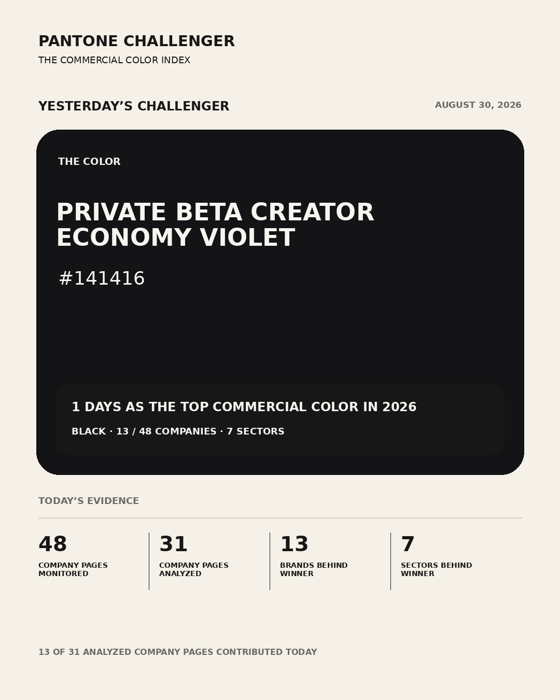
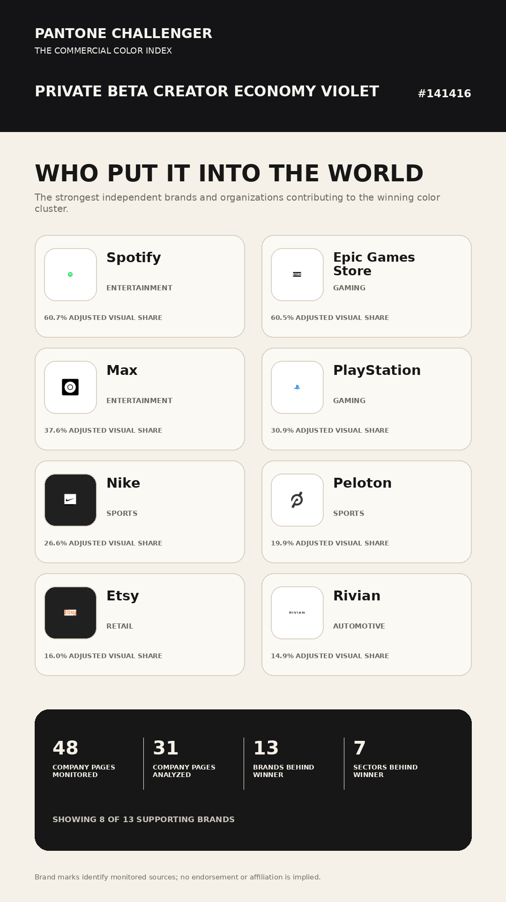
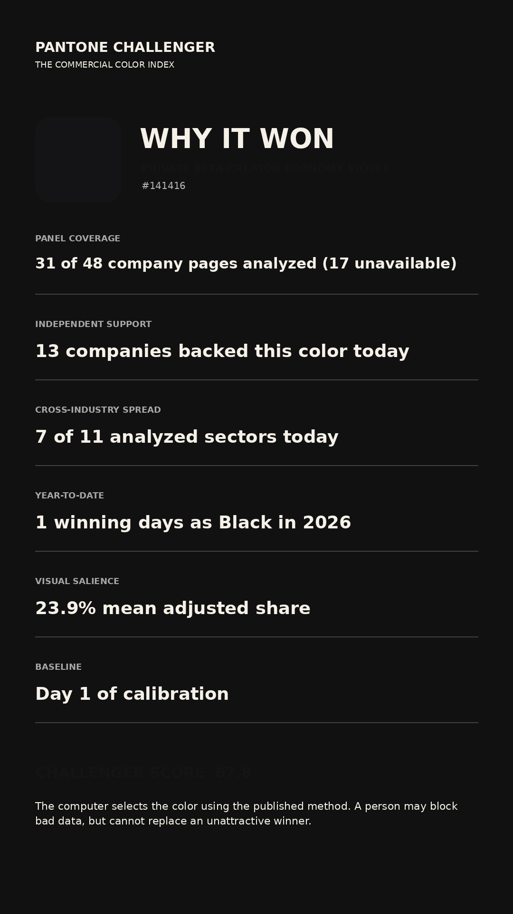
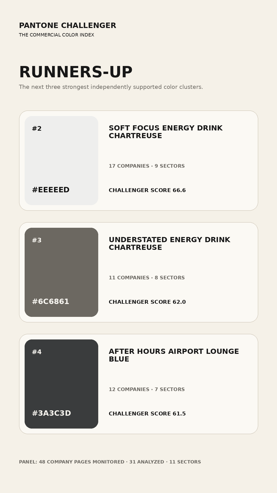

# Yesterday’s Challenger — 2026-08-30

## Coverage

| Company pages monitored | Successfully analyzed | Unavailable | Analyzed sectors | Winner support |
|---:|---:|---:|---:|---:|
| 48 | 31 | 17 | 11 | 13 sources / 7 sectors |

## Year-to-date recurrence

This is the 1st day in 2026 that Black ranked as the top color in the monitored commercial panel. Across those wins, it appeared across automotive, entertainment, food & beverage, and gaming, with 13 unique companies represented in the 48-company panel.

- **Color family:** Black `#141416`
- **Winning dates:** 2026-08-30
- **Current / longest streak:** 1 / 1 days
- **Unique companies across those wins:** 13 / 48
- **Sectors across those wins:** automotive, entertainment, food & beverage, gaming, retail, sports, and tech
- **Matching rule:** OKLab distance ≤ 0.055; exact HEX matches are not required.

## Winner: Private Beta Creator Economy Violet `#141416`

### Supporting sources
- **Spotify** — entertainment
- **Epic Games Store** — gaming
- **Max** — entertainment
- **PlayStation** — gaming
- **Nike** — sports
- **Peloton** — sports
- **Etsy** — retail
- **Rivian** — automotive
- **Toyota** — automotive
- **Microsoft** — technology
- **Xbox** — gaming
- **Walmart** — retail
- **Coca-Cola** — food beverage

## Runners-up
- **#2 Soft Focus Energy Drink Chartreuse** `#EEEEED` — 17 sources, 9 sectors, score 66.6
- **#3 Understated Energy Drink Chartreuse** `#6C6861` — 11 sources, 8 sectors, score 62.0
- **#4 After Hours Airport Lounge Blue** `#3A3C3D` — 12 sources, 7 sectors, score 61.5

## Story assets

> Review the capture report and observations before approving. Merging the pull request approves the measured result; it does not change the algorithmic winner.